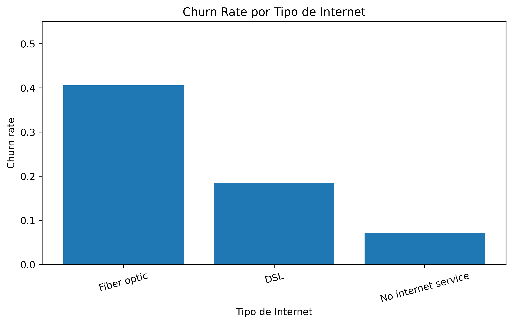
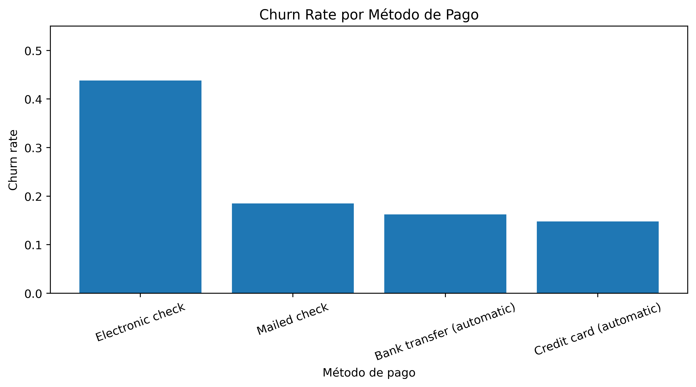
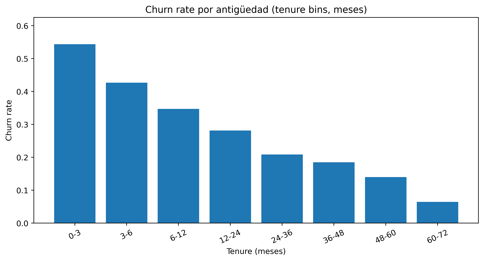
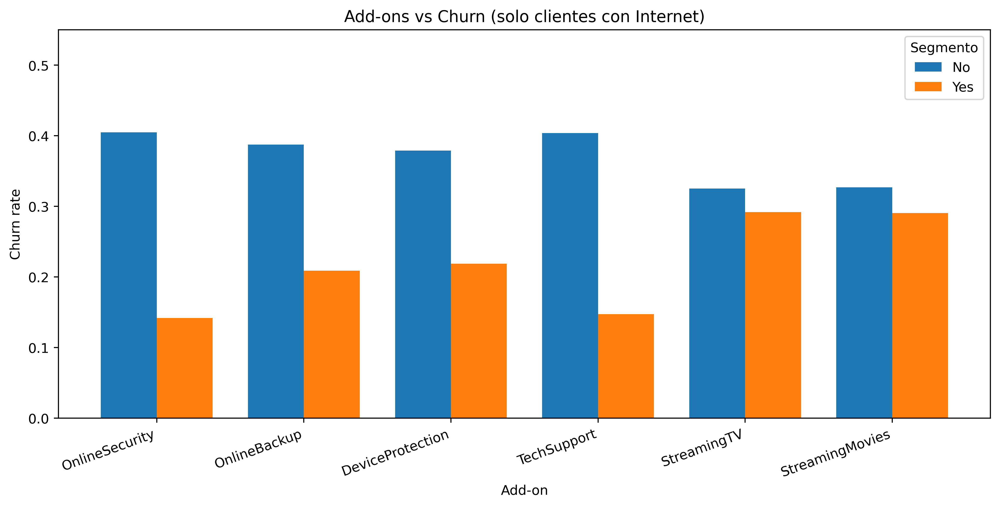

# 📊 Análisis de Cancelación de Clientes (Churn) — Sin Machine Learning
## TelecomX LATAM


---

# 🚀 Proyecto de Ciencia de Datos End-to-End (Enfoque EDA / Insights)

Este proyecto desarrolla un **pipeline completo de análisis exploratorio y descubrimiento de insights** para comprender y reducir la cancelación de clientes (**churn**) en la empresa ficticia **TelecomX LATAM**.

A diferencia de un proyecto predictivo, aquí el enfoque es **100% diagnóstico**:
- entender el **churn**
- identificar segmentos críticos
- priorizar acciones
- proponer estrategias de retención  
Todo esto **sin usar Machine Learning**.

---

# 🎯 Objetivos del Proyecto

- Calcular y contextualizar el **churn base** (tasa general).
- Identificar **variables** y **segmentos** asociados a mayor churn.
- Medir **lift**, **riesgo relativo** y **efecto por volumen** (clientes afectados).
- Analizar el **timing del churn** con cohortes por **antigüedad (tenure)**.
- Realizar **cruces multivariables** (2D/3D/6D) para encontrar “núcleos” de churn.
- Evaluar **add-ons** (soporte/seguridad/streaming) y su relación con churn (solo clientes con Internet).
- Entregar **recomendaciones accionables** y priorizadas por **impacto operativo**.

---

# 🧠 Flujo de Trabajo de Ciencia de Datos (Sin ML)

```text
Dataset TelecomX
        ↓
Limpieza y validación de tipos
        ↓
Cálculo de churn base
        ↓
Screening de variables (lift / riesgo)
        ↓
Segmentación por categorías y bins numéricos
        ↓
Cohortes por tenure (timing del churn)
        ↓
Cruces multivariables (2D / 3D / 6D)
        ↓
Análisis de add-ons (solo clientes con Internet)
        ↓
Priorización por # clientes afectados
        ↓
Recomendaciones estratégicas
```
---

# 🏗 Arquitectura del Pipeline de Insights (EDA)
```

[Dataset TelecomX]
      |
      v
[Preprocesamiento]
  - Normalización de Churn (0/1)
  - Conversión de numéricos (Charges, Tenure)
  - Derivación de categorías desde One-Hot
      |
      v
[Cálculo de churn base]
      |
      v
[Screening univariado]
  - churn por variable
  - lift / riesgo relativo
      |
      v
[Tenure bins]
  - análisis del timing del churn
      |
      v
[Cruces multivariables]
  - 2D / 3D / 6D (segmentos críticos)
      |
      v
[Add-ons vs churn (solo Internet)]
      |
      v
[Priorización por volumen]
  - customers / expected_churners / excess_churners
      |
      v
[Recomendaciones de negocio]
```

---

# 📂 Dataset

El dataset contiene información sobre clientes de TelecomX:

- características demográficas

- servicios contratados

- tipo de contrato

- tipo de internet

- servicios adicionales (add-ons)

- facturación y cargos

- métodos de pago

# Variable objetivo
Churn
- **1 → Cliente canceló el servicio**
- **0 → Cliente permanece**

---

# 🧹 Preparación de los Datos

Se aplicaron prácticas estándar de calidad de datos:

---

## Limpieza y consistencia

- normalización de la variable objetivo Churn a **0/1**

- conversión de campos de cobro a numéricos (ej. account.Charges.Monthly)

- validación de consistencia en campos One-Hot (contrato/servicios)

---

## Ingeniería de variables (para interpretabilidad)

Se derivaron columnas interpretables desde One-Hot, por ejemplo:

- Contract (Month-to-month / One year / Two year)

- InternetService (DSL / Fiber optic / No internet service)

- Add-ons (Yes/No): TechSupport, OnlineSecurity, StreamingTV, etc.

---

# 📏 Métricas Usadas (Sin ML)

- **Churn base**: P(Churn=1)

- **Churn por segmento**: P(Churn=1 | segmento)

- **Lift** vs **churn base**: churn_segmento / churn_base

- **Riesgo relativo (RR)** para variable binaria X:

   - RR = P(Churn=1 | X=1) / P(Churn=1 | X=0)

## **Impacto por volumen (clientes afectados)**

- expected_churners = churn_rate * customers

- excess_churners = (churn_rate - churn_base) * customers

(Nota: En este proyecto se prioriza por **# clientes** (impacto operativo), no por ingresos (MRR))

# 📊 Visualizaciones Clave (Alta Resolución)

### Distribución de churn (tasa base)


### Churn por tipo de contrato


### Churn por tipo de Internet


### Churn por método de pago


### Churn vs antigüedad del cliente (tenure bins)


### Add-ons vs churn (solo clientes con Internet)


---

# 🔥 Hallazgos Principales (Insights de Negocio)
## 1) Contrato: principal diferenciador del churn

- churn elevado en **contratos mes a mes**

- churn muy bajo en **contratos de mayor plazo**

**Lectura de negocio**: la permanencia contractual actúa como amortiguador del churn.

**Implicación**: migración de contrato + ofertas de retención temprana.

## 2) Timing: el churn se concentra en etapas tempranas (tenure)

Se analizaron cohortes con bins fijos de tenure (meses):

- `0–3`, `3–6`, `6–12`, `12–24`, `24–36`, `36–48`, `48–60`, `60–72`

**Lectura de negocio**: existe un problema de **early-life churn**.

**Implicación**: programa de retención 0–90 días (onboarding, primera factura, resolución proactiva).

## 3) Método de pago: segmentación relevante del churn

Existen métodos de pago con churn más alto que se vuelven candidatos para:

- reducción de fricción de cobro

- migración a esquemas más estables (p. ej. autopago)

- campañas específicas por cohortes de alto riesgo

## 4) Add-ons protectores (solo clientes con Internet)

En clientes con Internet, los add-ons de **Soporte Técnico** y **Seguridad en línea** presentan una asociación fuerte con menor churn.

**Lectura de negocio**: soporte/seguridad funcionan como protecciones de retención.

**Implicación**: bundles de Soporte + Seguridad para segmentos críticos.

---

# 🎯 Segmentación y Cruces Multivariables (Dónde se concentra el churn)

Cruces aplicados para encontrar “núcleos” de churn:

- TenureGroup × Contract

- Contract × PaymentMethod

- TenureGroup × Contract × PaymentMethod

- InternetService × TechSupport

- InternetService × TechSupport × OnlineSecurity

- Segmentación 6D para localizar combinaciones críticas con volumen

Priorización por:

- churn_rate y lift

- customers

- expected_churners y excess_churners

---

# 💡 Impacto de Negocio (Recomendaciones Accionables)
## 1) Retención temprana (0–90 días)

- contacto proactivo post-instalación

- seguimiento del primer ciclo de facturación

- detección temprana de fricción (pagos / soporte)

- onboarding operativo para reducir cancelaciones rápidas

## 2) Estrategia de migración de contrato

- incentivos para pasar de mes-a-mes a 1 o 2 años

- ofertas ligadas a bundles protectores

## 3) Optimización de pagos

- campañas para migrar a métodos más estables

- reducción de fricción de cobro y comunicación clara de cargos

## 4) Add-ons como “escudo” anti-churn

- empaquetar **Soporte + Seguridad** para clientes con Internet

- priorizar cohorts de alto riesgo (p. ej., nuevos + mes-a-mes)

## 5) Internet: foco por tipo de servicio

- análisis específico por tipo de Internet (p. ej. fibra)

- enfoque en experiencia y percepción del servicio (sin ML)

---

# 🛠 Tecnologías Utilizadas
```
Python
Pandas
NumPy
Matplotlib
Google Colab
GitHub
```
---

# 📁 Estructura del Repositorio
```
telecomx-churn-analysis/

├── TelecomX_LATAM.ipynb
├── README.md
└── images/
    ├── Churn_general_tasa_base.png
    ├── Churn_rate_por_tipo_de_contrato.png
    ├── Churn_rate_por_tipo_de_internet.png
    ├── Churn_rate_por_metodo_de_pago.png
    ├── Churn_rate_por_antiguedad_tenure_bins.png
    └── Add_ons_vs_Churn_solo_internet.png
```

---

# 🔬 Reproducibilidad

Clonar repositorio:
```
git clone https://github.com/tu_usuario/telecomx-churn-analysis
```
Instalar dependencias:
```
pip install pandas numpy matplotlib
```
Abrir el notebook en Google Colab o Jupyter Notebook.

---

# 🔮 Mejoras Futuras (Opcionales)

- incorporar métricas operativas (tickets, calidad, caídas)

- A/B testing de bundles y ofertas de contrato

- Habilitar Machine Learning scoring de churn y modelos interpretables (**Challenge Parte II**)

---

# ⭐ Portafolio de Data Science

Este proyecto forma parte de mi portafolio donde aplico:

- análisis exploratorio avanzado (EDA)

- segmentación y cohortes

- métricas de negocio (lift / RR / impacto por volumen)

- storytelling con visualizaciones

- recomendaciones accionables

---

# 👨‍💻 Autor

**Carlos Patricio Luis Castillo**

Proyecto de Ciencia de Datos
Análisis EDA/Insights aplicado a churn en telecomunicaciones (sin Machine Learning).
